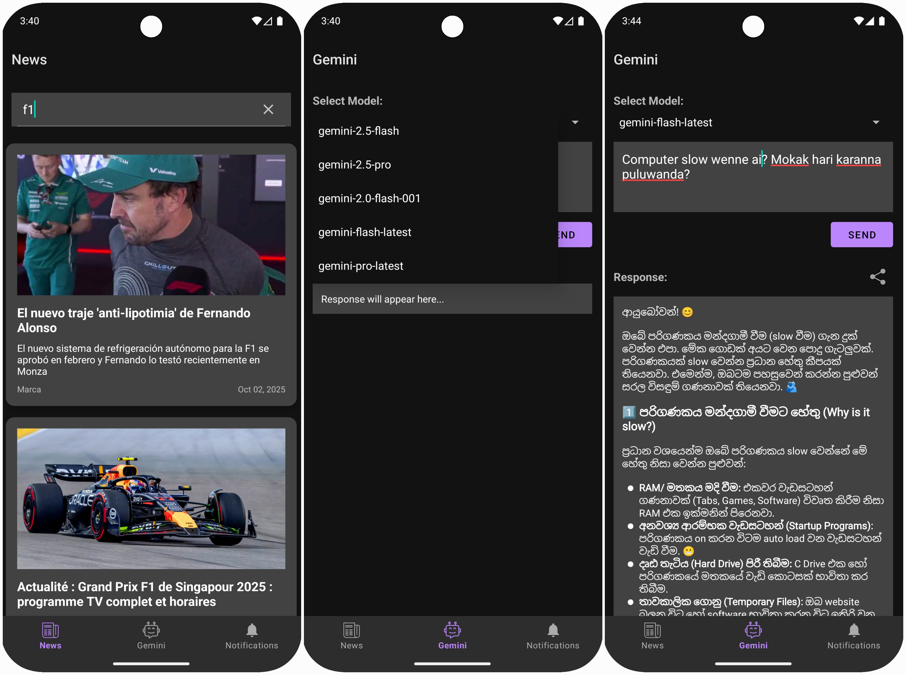
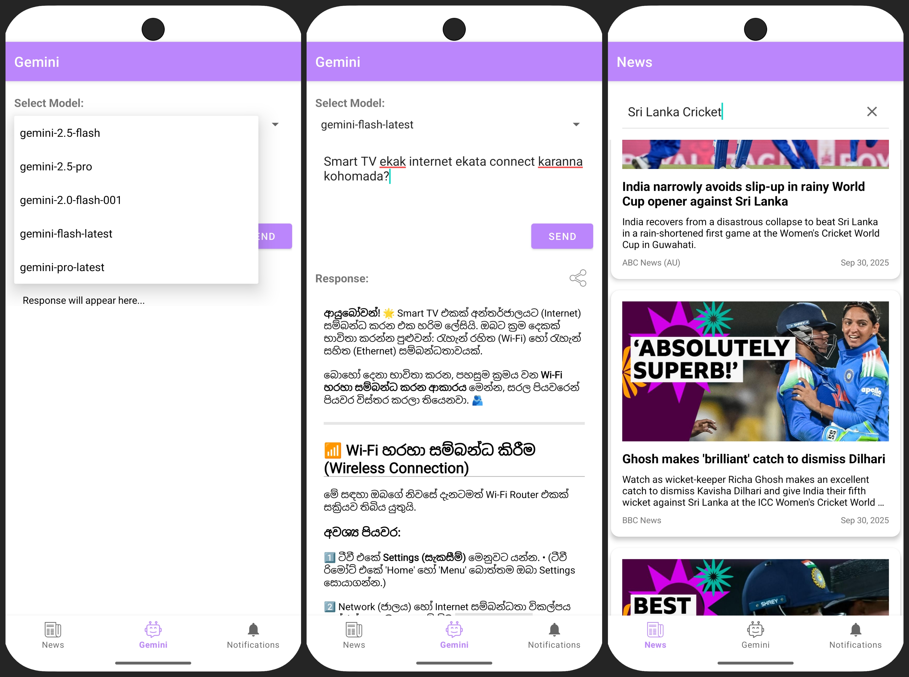

# News and AI App

> [!NOTE]
> A localized Gemini AI chat experience crafted for Sri Lankan users. Understands Singlish and responds in proper Sinhala, plus integrated news fetching.

##  Features

-  **Localized AI Assistant**: Custom Gemini AI tailored for Sri Lankan users  
-  **Singlish to Sinhala**: Understands Singlish input and responds in proper Sinhala  
-  **News Integration**: Fetches the latest news articles related to your query using News API  
-  **Material Design**: Beautiful UI with Android Material Design components  
-  **Markdown syntax**: Rich text rendering for formatted responses  
-  **Expressive Conversations**: Uses emojis and culturally appropriate responses  

---

##  How to Clone and Setup

> [!TIP]
> Make sure you have the latest Android Studio and proper SDK components installed.

### 1. Clone the Repository
```bash
git clone https://github.com/Kaveesha125/news-app-with-ai-chat.git
cd news-app-with-ai-chat
```

### 2. Open in Android Studio
Let Gradle sync automatically.

### 3. Setup API Keys (Required)

---

##  Where to Get API Keys

> [!IMPORTANT]
> You must create your own API keys. Do **not** share or commit them.

### Gemini API Key
1. Go to [Google AI Studio](https://makersuite.google.com/app/apikey)  
2. Sign in  
3. Create an API key  
4. Copy it  

### News API Key
1. Go to [NewsAPI.org](https://newsapi.org/)
2. Sign up  
3. Copy the key from dashboard  

---

##  Where to Put API Keys

> [!CAUTION]
> Do **not** commit your `local.properties` file to version control.

Create or open `local.properties` at the project root and add:
```properties
GEMINI_API_KEY=paste_your_gemini_api_key_here
NEWS_API_KEY=paste_your_news_api_key_here
```

> [!WARNING]
> If you accidentally push real keys, revoke and replace them immediately.

## Dark Theme


## Light Theme



---

Demonstration:


---